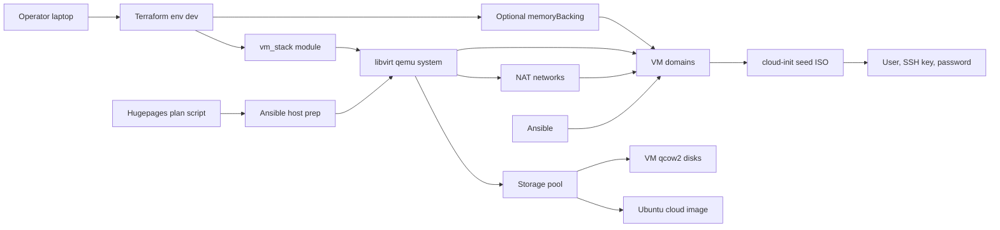

# Architecture

This project provisions a local virtualization lab with Terraform and libvirt.

## Terraform flow

1. `terraform/envs/nonprod/dev` configures the `libvirt` provider and calls the VM stack module.
2. `terraform/modules/vm_stack` creates a storage pool, NAT networks, VM disks, cloud-init seed ISOs, and libvirt domains.
3. Cloud-init injects the default user, SSH public key, password, hostname, and static network configuration.
4. Optional `hugepages` VM settings emit libvirt `memoryBacking` for selected domains.

## Hugepages flow

1. `scripts/hugepages-plan.sh` reads `terraform.tfvars` through `terraform console`.
2. The script calculates how many hugepages the host must reserve for VMs with `hugepages.enabled = true`.
3. `ansible/playbook/prepare-hugepages.yml` applies the host sysctl setting for 2 MiB hugepages.
4. Terraform then applies VM domain XML with hugepage-backed memory for the selected VMs.

## CI boundary

GitLab CI runs formatting, Terraform validation, and Ansible syntax checks with the custom image from the GitLab Container Registry. It does not run hugepages host preparation or `terraform apply` because those require access to a real local libvirt host.
